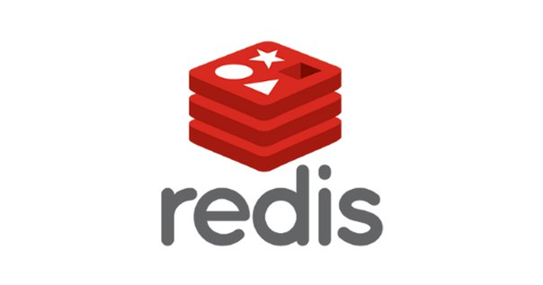

# About Redis

It is a NoSQL database written in C, designed as key-value. Because it keeps data in memory, very fast reading and writing is done.

## Data Types

- String
  
- Hash
  
- List
  
- Set
  
- Sorted Set

## Setup

All you have to do for installation is ” [https://github.com/MSOpenTech/redis/releases]() download the installation file from " Redis-server first, then.after this process, you will run the exe program and activate the Redis server redis-cli in the same folder.when you run the exe plugin, you can now use the Redis database system to create your databases.
  

## Advantage

1. Simplicity and ease of use
  
  > Redis simplifies your code by allowing you to write fewer lines of code for data storage, access, and use in your applications.Java, Python, PHP, C, C++, C#, JavaScript, Node.many languages are supported, including js, Ruby, R, and Go.
  
2. Flexible data structures
  
  > Unlike simple key-value data stores that offer limited data structure, Redis has a wide range of data structures to suit the needs of your applications. Redis data types include:
  > 
  > - Strings-text or binary data up to 512 MB in size
  >   
  > - Lists-string collection in the order in which they are added
  >   
  > - Sets – non-ordered collection of Strings; has intersection, join, and difference with other types of sets
  >   
  > - Sorted Sets – sorted sets by value
  >   
  
3. In-memory data store
  
  > Unlike PostgreSQL, Cassandra, MongoDB, and other databases, which store most of the data on disk or SSD, all Redis data is stored in the server's main memory. In-memory data stores such as Redis do not need the same transfer compared to traditional disk-based databases, which require disk-based data transfer for most operations. Therefore, these databases support more operations and faster response times.
